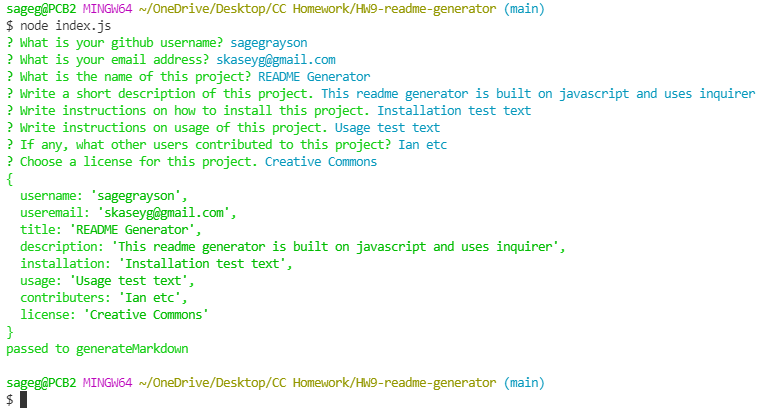

# HW9-Readme-Generator

## Description

This readme generator is built on Javascript and uses Inquirer to prompt the user. The application takes the user's responses and generates a basic README file.

## Usage

When installed, use the command "node index.js". After the user has completed the questions, a README file will be in the "generated" folder.

## Contact

Link to my github: [sagegrayson](https://github.com/sagegrayson)

If you'd like to contact me, email me at [skaseyg@gmail.com](mailto:skaseyg@gmail.com)
